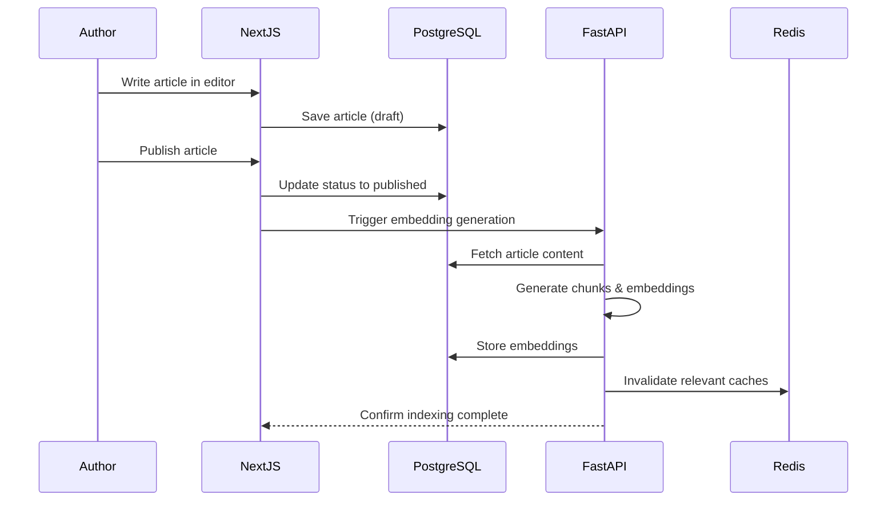
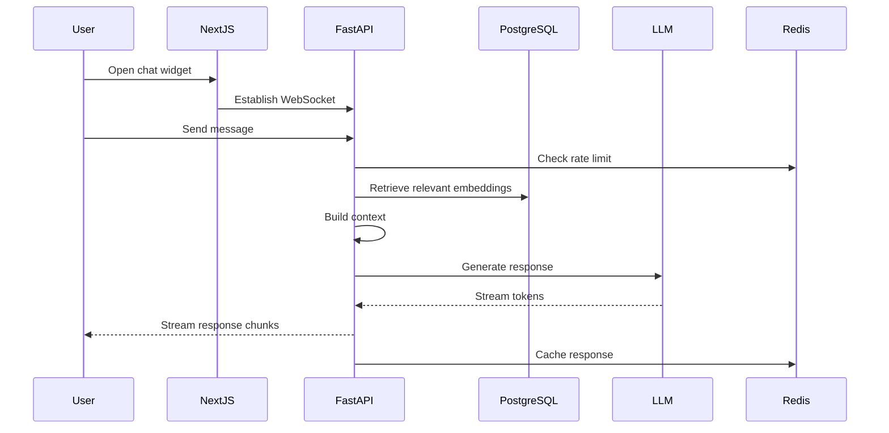
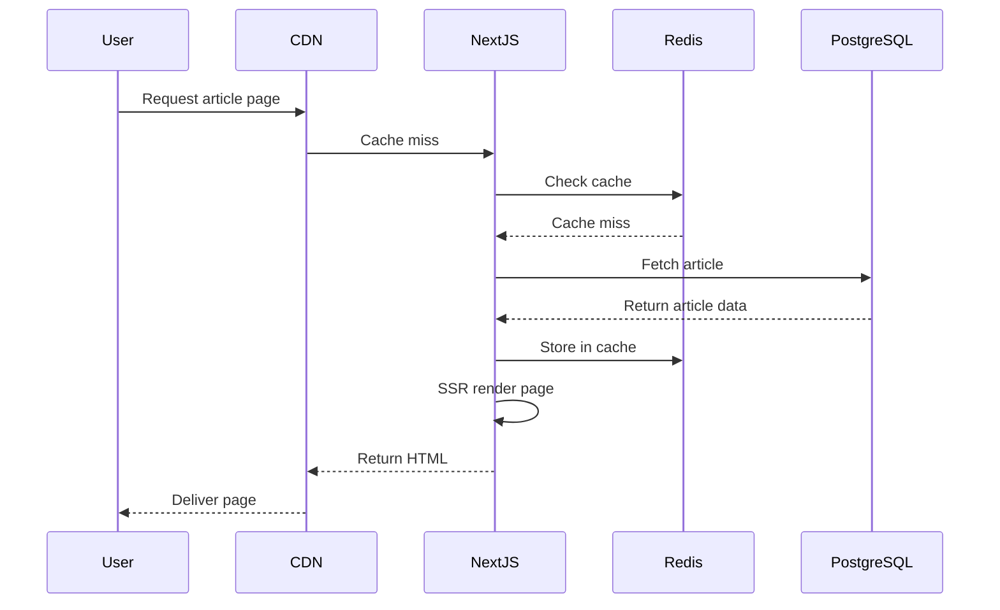

# System Architecture - AI-Powered Technical Blog

> **Note**: For production deployment on Railway platform, please refer to [RAILWAY_ARCHITECTURE.md](./RAILWAY_ARCHITECTURE.md) which provides Railway-specific configuration, deployment strategies, and platform integration details.

## Table of Contents
1. [Executive Summary](#executive-summary)
2. [System Overview](#system-overview)
3. [Architecture Principles](#architecture-principles)
4. [System Layers](#system-layers)
5. [Technology Stack](#technology-stack)
6. [Data Flow Architecture](#data-flow-architecture)
7. [Communication Patterns](#communication-patterns)
8. [Security Architecture](#security-architecture)
9. [Performance Considerations](#performance-considerations)
10. [Scalability Strategy](#scalability-strategy)

## Executive Summary

This document outlines the technical architecture for an AI-powered technical blog platform. The system combines a modern content management system with an intelligent AI assistant that understands published articles, their relationships, and information about the author. The architecture prioritizes simplicity, maintainability, and cost-effectiveness while delivering a powerful user experience.

### Key Features
- Web-based article writing and publishing
- Rich content support (markdown, code, images, diagrams)
- AI assistant with deep article understanding
- Real-time chat interface with streaming responses
- Automatic content indexing and semantic search
- Rate-limited public access

### Target Metrics
- **Budget**: $20-50/month operational cost
- **Response Time**: <2s for page loads, <5s for AI responses
- **Availability**: 99.9% uptime for blog, 99% for AI features
- **Scale**: Support up to 10,000 monthly active users

## System Overview

### High-Level Architecture

```
┌────────────────────────────────────────────────────────┐
│                     User Browser                       │
│  ┌─────────────────────────────────────────────────┐  │
│  │  Next.js Frontend (React)                       │  │
│  │  - Blog Reader View                             │  │
│  │  - Admin Dashboard                              │  │
│  │  - AI Chat Widget                               │  │
│  └─────────────────────────────────────────────────┘  │
└────────────┬──────────────────┬────────────────────────┘
             │ HTTPS            │ WSS
             │                  │
┌────────────▼──────────────────▼────────────────────────┐
│                    API Gateway Layer                   │
│  ┌──────────────────┐  ┌──────────────────────────┐  │
│  │  Next.js API     │  │  FastAPI Backend        │  │
│  │  - Auth          │  │  - AI Chat (WebSocket)  │  │
│  │  - Articles CRUD │  │  - Embeddings API       │  │
│  │  - Image Upload  │  │  - Search API           │  │
│  └──────────────────┘  └──────────────────────────┘  │
└────────────┬──────────────────┬────────────────────────┘
             │                  │
┌────────────▼──────────────────▼────────────────────────┐
│                     Data Layer                         │
│  ┌───────────┐  ┌────────────┐  ┌─────────────────┐  │
│  │PostgreSQL │  │   Redis    │  │  Object Storage │  │
│  │+ pgvector │  │   Cache    │  │  (Images/Files) │  │
│  └───────────┘  └────────────┘  └─────────────────┘  │
└─────────────────────────────────────────────────────────┘
             │
┌────────────▼────────────────────────────────────────────┐
│              External Services                          │
│  ┌─────────────┐  ┌──────────────┐  ┌──────────────┐  │
│  │  OpenAI/    │  │   Pinecone   │  │  Cloudinary  │  │
│  │  Claude API │  │  (Optional)  │  │  (Images)    │  │
│  └─────────────┘  └──────────────┘  └──────────────┘  │
└─────────────────────────────────────────────────────────┘
```

## Architecture Principles

### 1. Separation of Concerns
- **Frontend (Next.js)**: Handles UI rendering, user interactions, and basic CRUD operations
- **Backend (FastAPI)**: Manages AI operations, heavy computations, and real-time features
- **Data Layer**: Provides persistent storage and caching with clear boundaries

### 2. Service Boundaries
- Each service has well-defined responsibilities
- Services communicate through documented APIs
- Shared database access is minimized

### 3. Scalability by Design
- Stateless services for horizontal scaling
- Cache-first approach for read operations
- Async processing for heavy computations

### 4. Developer Experience
- Single repository (monorepo) structure
- Docker-based development environment
- Hot-reload in development mode

### 5. Cost Optimization
- Leverage free tiers where possible
- Efficient caching strategies
- On-demand resource allocation

## System Layers

### 1. Presentation Layer (Frontend)

**Technology**: Next.js 14+ with React 18

**Responsibilities**:
- Server-side rendering for SEO optimization
- Client-side interactivity for admin panel
- Progressive enhancement for better UX
- Responsive design for mobile/desktop

**Key Components**:
```
app/
├── (public)/
│   ├── page.tsx           # Blog homepage
│   ├── articles/
│   │   └── [slug]/
│   │       └── page.tsx   # Article view
│   └── about/
│       └── page.tsx       # Author information
├── (admin)/
│   ├── admin/
│   │   ├── page.tsx       # Dashboard
│   │   ├── write/
│   │   │   └── page.tsx   # Article editor
│   │   └── settings/
│   │       └── page.tsx   # Configuration
└── components/
    ├── ChatWidget.tsx     # AI Assistant UI
    ├── Editor.tsx         # Rich text editor
    └── ArticleCard.tsx    # Content display
```

### 2. Application Layer (Next.js Backend)

**Technology**: Next.js API Routes

**Responsibilities**:
- Authentication and authorization
- Article CRUD operations
- Image upload and processing
- Session management
- Basic API endpoints

**API Structure**:
```
app/api/
├── auth/
│   ├── login/route.ts
│   └── logout/route.ts
├── articles/
│   ├── route.ts           # GET all, POST new
│   └── [id]/route.ts      # GET, PUT, DELETE
├── images/
│   └── upload/route.ts
└── health/route.ts
```

### 3. Service Layer (FastAPI)

**Technology**: FastAPI with Python 3.11+

**Responsibilities**:
- AI chat handling via WebSocket
- Embedding generation and management
- Vector similarity search
- RAG pipeline orchestration
- Background task processing

**Service Structure**:
```
backend/
├── app/
│   ├── main.py            # FastAPI application
│   ├── api/
│   │   ├── chat.py        # WebSocket chat endpoint
│   │   ├── embeddings.py  # Embedding generation
│   │   └── search.py      # Semantic search
│   ├── services/
│   │   ├── llm.py         # LLM integration
│   │   ├── rag.py         # RAG pipeline
│   │   ├── chunker.py     # Text chunking
│   │   └── vectordb.py    # Vector operations
│   ├── models/
│   │   └── schemas.py     # Pydantic models
│   └── utils/
│       ├── cache.py       # Redis operations
│       └── ratelimit.py   # Rate limiting
```

### 4. Data Access Layer

**Technologies**:
- Prisma ORM (Next.js)
- SQLAlchemy (FastAPI)
- Redis client libraries

**Responsibilities**:
- Database connection management
- Query optimization
- Transaction handling
- Cache invalidation
- Connection pooling

### 5. Infrastructure Layer

**Components**:

#### PostgreSQL Database
- Primary data store for articles, users, metadata
- pgvector extension for embedding storage
- Full-text search capabilities
- JSONB for flexible schema

#### Redis Cache
- Session storage
- API response caching
- Rate limiting counters
- Real-time data for WebSockets

#### Object Storage
- Cloudinary or S3 for images
- CDN distribution
- Automatic image optimization

## Technology Stack

### Core Technologies

| Layer | Technology | Rationale |
|-------|------------|-----------|
| **Frontend Framework** | Next.js 14+ | SSR/SSG, React ecosystem, API routes, excellent DX |
| **Backend Framework** | FastAPI | Async Python, WebSocket support, automatic API docs |
| **Programming Languages** | TypeScript, Python | Type safety, extensive libraries |
| **Database** | PostgreSQL 15 | Robust, pgvector support, JSONB flexibility |
| **Vector Storage** | pgvector | Integrated with PostgreSQL, cost-effective |
| **Cache** | Redis 7 | Fast, versatile, pub/sub support |
| **ORM/ODM** | Prisma, SQLAlchemy | Type-safe queries, migrations |
| **Styling** | Tailwind CSS | Utility-first, consistent design |
| **UI Components** | shadcn/ui | Customizable, accessible, modern |
| **Editor** | TipTap/Novel | Extensible, great UX |
| **LLM Provider** | OpenAI/Anthropic | Cost-effective models (GPT-4o-mini/Claude Haiku) |
| **Deployment** | Docker | Consistent environments, easy deployment |

### Development Tools

| Tool | Purpose |
|------|---------|
| **pnpm** | Efficient package management |
| **Docker Compose** | Local development environment |
| **ESLint/Prettier** | Code quality and formatting |
| **Black/Ruff** | Python formatting and linting |
| **Vitest/Pytest** | Testing frameworks |
| **GitHub Actions** | CI/CD pipeline |

## Data Flow Architecture

### 1. Article Publishing Flow



### 2. AI Chat Flow



### 3. Content Retrieval Flow



## Communication Patterns

### 1. REST API Communication

**Next.js ↔ FastAPI**
```typescript
// Next.js API route calling FastAPI
async function generateEmbeddings(articleId: string) {
  const response = await fetch(`${FASTAPI_URL}/api/embeddings`, {
    method: 'POST',
    headers: {
      'Content-Type': 'application/json',
      'X-API-Key': process.env.INTERNAL_API_KEY
    },
    body: JSON.stringify({ article_id: articleId })
  });
  return response.json();
}
```

### 2. WebSocket Communication

**Browser ↔ FastAPI**
```javascript
// Client-side WebSocket connection
const ws = new WebSocket('wss://api.blog.com/ws/chat');
ws.onmessage = (event) => {
  const data = JSON.parse(event.data);
  if (data.type === 'stream') {
    appendToChat(data.content);
  }
};
```

### 3. Event-Driven Communication

**Using Redis Pub/Sub**
```python
# FastAPI publishing event
async def publish_event(event_type: str, payload: dict):
    await redis.publish(
        f"blog:events:{event_type}",
        json.dumps(payload)
    )

# Next.js subscribing to events
redis.subscribe('blog:events:article_indexed', (data) => {
  invalidateCache(`article:${data.articleId}`);
});
```

## Security Architecture

### 1. Authentication & Authorization

**Strategy**: JWT with refresh tokens

```typescript
// Authentication flow
interface AuthToken {
  userId: string;
  role: 'admin' | 'reader';
  exp: number;
}

// Middleware protection
export async function middleware(request: NextRequest) {
  const token = await getToken({ req: request });

  if (request.nextUrl.pathname.startsWith('/admin')) {
    if (!token || token.role !== 'admin') {
      return NextResponse.redirect('/login');
    }
  }
}
```

### 2. API Security

**Rate Limiting**
```python
# FastAPI rate limiting
from slowapi import Limiter
limiter = Limiter(key_func=get_remote_address)

@app.get("/api/chat")
@limiter.limit("10/minute")
async def chat_endpoint():
    pass
```

**Input Validation**
```python
# Pydantic model for validation
class ChatMessage(BaseModel):
    content: str = Field(..., min_length=1, max_length=1000)
    session_id: str = Field(..., regex="^[a-zA-Z0-9-]+$")
```

### 3. Data Protection

- **Encryption at rest**: Database encryption
- **Encryption in transit**: HTTPS/WSS only
- **Sensitive data**: Environment variables
- **SQL injection prevention**: Parameterized queries
- **XSS prevention**: Content sanitization

## Performance Considerations

### 1. Caching Strategy

**Multi-Level Caching**
```
Browser Cache (Static Assets)
    ↓
CDN Cache (Pages, Images)
    ↓
Application Cache (Redis)
    ↓
Database Cache (Query Results)
```

**Cache Keys**
```typescript
const cacheKeys = {
  article: (slug: string) => `article:${slug}`,
  articleList: (page: number) => `articles:page:${page}`,
  embedding: (articleId: string) => `embedding:${articleId}`,
  aiResponse: (hash: string) => `ai:response:${hash}`
};
```

### 2. Database Optimization

**Indexing Strategy**
```sql
-- Performance indexes
CREATE INDEX idx_articles_published ON articles(published_at DESC);
CREATE INDEX idx_articles_slug ON articles(slug);
CREATE INDEX idx_embeddings_article ON embeddings(article_id);

-- Vector similarity index
CREATE INDEX idx_embeddings_vector ON embeddings
USING ivfflat (embedding vector_cosine_ops);
```

### 3. Response Optimization

- **Lazy loading**: Images and non-critical JS
- **Code splitting**: Route-based chunking
- **Compression**: Gzip/Brotli for text assets
- **Image optimization**: WebP format, responsive sizes

## Scalability Strategy

### Horizontal Scaling Approach

```yaml
# Docker Swarm/Kubernetes scaling
services:
  nextjs:
    replicas: 3  # Scale based on traffic

  fastapi:
    replicas: 2  # Scale based on AI load

  postgres:
    replicas: 1  # Primary + read replicas

  redis:
    replicas: 1  # Redis Cluster for HA
```

### Resource Allocation

| Service | Memory | CPU | Scaling Trigger |
|---------|--------|-----|-----------------|
| Next.js | 512MB | 0.5 | CPU > 70% |
| FastAPI | 1GB | 1.0 | Request queue > 10 |
| PostgreSQL | 2GB | 1.0 | Connections > 80% |
| Redis | 256MB | 0.25 | Memory > 80% |

### Growth Milestones

**Phase 1 (0-1000 users/month)**
- Single instance of each service
- Shared PostgreSQL database
- Local Redis cache

**Phase 2 (1000-10,000 users/month)**
- Multiple Next.js instances
- FastAPI with queue workers
- PostgreSQL read replicas
- Redis Cluster

**Phase 3 (10,000+ users/month)**
- Kubernetes orchestration
- Dedicated AI service cluster
- Multi-region deployment
- Advanced monitoring

## Monitoring & Observability

### Key Metrics

```typescript
// Application metrics
const metrics = {
  // Performance
  responseTime: histogram('http_response_time'),
  dbQueryTime: histogram('db_query_duration'),
  aiResponseTime: histogram('ai_response_time'),

  // Business
  articlesPublished: counter('articles_published_total'),
  aiQueriesProcessed: counter('ai_queries_total'),

  // System
  errorRate: counter('errors_total'),
  cacheHitRate: gauge('cache_hit_ratio')
};
```

### Health Checks

```typescript
// Comprehensive health check
export async function GET() {
  const checks = {
    database: await checkDatabase(),
    redis: await checkRedis(),
    fastapi: await checkFastAPI(),
    storage: await checkStorage()
  };

  const healthy = Object.values(checks).every(c => c.status === 'ok');

  return NextResponse.json({
    status: healthy ? 'healthy' : 'degraded',
    checks
  }, { status: healthy ? 200 : 503 });
}
```

## Disaster Recovery

### Backup Strategy

1. **Database**: Daily automated backups, 30-day retention
2. **Embeddings**: Regeneratable from source articles
3. **Images**: CDN/Cloud storage with redundancy
4. **Configuration**: Version controlled in Git

### Recovery Plan

```bash
# Disaster recovery procedure
1. Restore database from backup
2. Rebuild embeddings: python manage.py rebuild_embeddings
3. Clear caches: redis-cli FLUSHALL
4. Restart services: docker-compose up -d
5. Verify health: curl https://api.blog.com/health
```

## Conclusion

This architecture provides a solid foundation for an AI-powered technical blog that is:

- **Maintainable**: Clear separation of concerns and documented interfaces
- **Scalable**: Can grow from hobby project to production platform
- **Cost-effective**: Optimized for $20-50/month budget with growth potential
- **Performant**: Multi-level caching and optimized data flow
- **Secure**: Industry-standard security practices
- **Observable**: Comprehensive monitoring and health checks

The modular design allows for incremental development and deployment, starting with basic blog functionality and progressively adding AI features as needed.

**Deployment Platform**: Railway has been selected as the all-in-one hosting platform for this architecture, providing unified deployment, automatic scaling, built-in monitoring, and simplified DevOps at ~$25/month. See [RAILWAY_ARCHITECTURE.md](./RAILWAY_ARCHITECTURE.md) for detailed Railway-specific implementation.