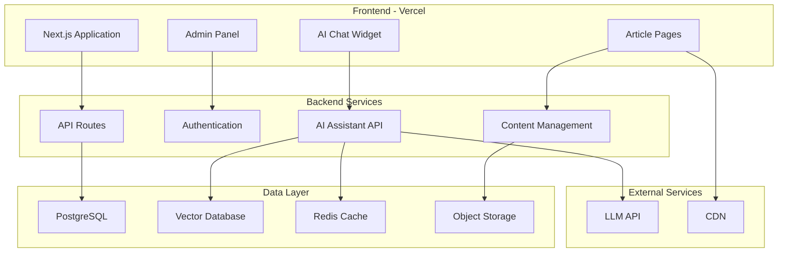
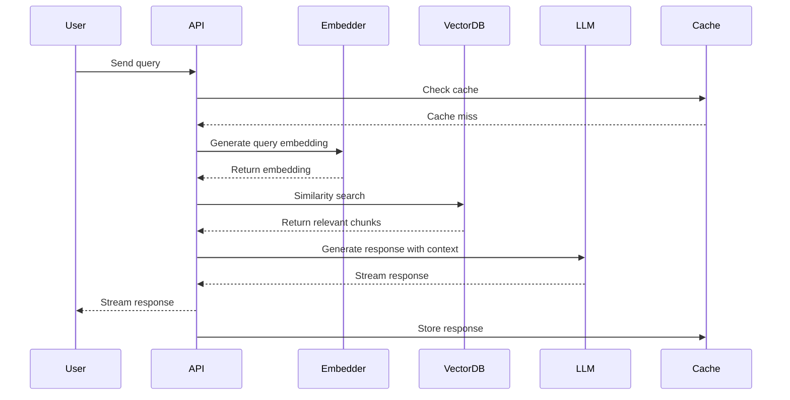

# Technical Blog with AI Assistant - Complete Technical Specification

## Executive Summary

This document outlines the complete technical specification for building a modern technical blog platform with an integrated AI assistant. The platform is designed for a Machine Learning Engineer focusing on LLM operations, featuring a web-based content management system, rich markdown editor, and an intelligent AI assistant that helps readers understand and navigate the content.

## Table of Contents

1. [Project Overview](#project-overview)
2. [System Architecture](#system-architecture)
3. [Technology Stack](#technology-stack)
4. [Implementation Phases](#implementation-phases)
5. [Database Design](#database-design)
6. [AI Assistant Architecture](#ai-assistant-architecture)
7. [Cost Analysis](#cost-analysis)
8. [Deployment Strategy](#deployment-strategy)
9. [Security Considerations](#security-considerations)
10. [Performance Optimization](#performance-optimization)
11. [Future Enhancements](#future-enhancements)

## Project Overview

### Objectives
- **Primary Goal**: Create a professional technical blog with integrated AI assistance
- **Target Audience**: Technical professionals, ML engineers, developers
- **Core Features**:
  - Web-based article writing and publishing
  - Rich content support (code, images, diagrams)
  - AI assistant for content understanding and navigation
  - Personal knowledge base about the author
  - Rate-limited public access

### Key Requirements
1. **Content Creation**: Browser-based editor with markdown, code, and diagram support
2. **AI Integration**: Intelligent assistant that understands all published content
3. **User Experience**: Clean, fast, accessible design for technical content
4. **Maintainability**: Simple deployment and content management
5. **Budget**: $20-50/month operational cost

## System Architecture

### High-Level Architecture



### Component Breakdown

#### 1. Frontend Layer
- **Framework**: Next.js 14+ with App Router
- **Styling**: Tailwind CSS + shadcn/ui components
- **Editor**: TipTap or Novel (Notion-like experience)
- **Rendering**: MDX for rich content display
- **State Management**: Zustand for global state
- **Real-time**: Socket.io for live features

#### 2. Backend Services
- **API**: Next.js API routes (serverless functions)
- **Authentication**: NextAuth.js with JWT
- **File Upload**: Direct to S3/Cloudinary
- **Queue System**: BullMQ for background jobs
- **WebSockets**: For streaming AI responses

#### 3. Data Storage
- **Primary Database**: PostgreSQL (Supabase/Neon)
- **Vector Store**: Pinecone for embeddings
- **Cache Layer**: Redis (Upstash)
- **File Storage**: S3 or Cloudinary
- **Search Index**: PostgreSQL full-text search

## Technology Stack

### Core Technologies

| Component | Technology | Rationale |
|-----------|------------|-----------|
| **Framework** | Next.js 14+ | Full-stack capabilities, excellent DX, built-in optimizations |
| **Language** | TypeScript | Type safety, better IDE support, fewer runtime errors |
| **Database** | PostgreSQL | Reliable, feature-rich, excellent JSON support |
| **Vector DB** | Pinecone | Managed service, generous free tier, fast similarity search |
| **Styling** | Tailwind CSS | Utility-first, consistent design, great DX |
| **UI Library** | shadcn/ui | Modern components, fully customizable, accessible |
| **Editor** | TipTap | Extensible, powerful, great UX |
| **Auth** | NextAuth.js | Flexible, secure, easy integration |
| **LLM** | Claude Haiku / GPT-4o-mini | Cost-effective, fast, good performance |
| **Deployment** | Vercel | Zero-config, excellent Next.js support |

### Development Tools

- **Version Control**: Git + GitHub
- **Package Manager**: pnpm (faster, efficient)
- **Linting**: ESLint + Prettier
- **Testing**: Vitest + Playwright
- **CI/CD**: GitHub Actions
- **Monitoring**: Sentry + Vercel Analytics

## Implementation Phases

### Phase 1: Foundation (Week 1)

#### 1.1 Project Setup
```bash
# Initialize Next.js project
npx create-next-app@latest blog-ai --typescript --tailwind --app
cd blog-ai

# Install core dependencies
pnpm add @supabase/supabase-js next-auth @tiptap/react lucide-react
pnpm add -D @types/node
```

#### 1.2 Database Setup
- Initialize Supabase project
- Create database schema
- Set up connection pooling
- Configure row-level security

#### 1.3 Authentication System
```typescript
// app/api/auth/[...nextauth]/route.ts
import NextAuth from 'next-auth'
import CredentialsProvider from 'next-auth/providers/credentials'

export const authOptions = {
  providers: [
    CredentialsProvider({
      name: 'credentials',
      credentials: {
        email: { label: "Email", type: "email" },
        password: { label: "Password", type: "password" }
      },
      async authorize(credentials) {
        // Validate against database
        // Return user object or null
      }
    })
  ],
  session: { strategy: 'jwt' },
  pages: {
    signIn: '/admin/login',
  }
}
```

### Phase 2: Content Management (Week 2)

#### 2.1 Rich Text Editor Implementation
```typescript
// components/editor/ArticleEditor.tsx
import { useEditor } from '@tiptap/react'
import StarterKit from '@tiptap/starter-kit'
import CodeBlockLowlight from '@tiptap/extension-code-block-lowlight'
import Image from '@tiptap/extension-image'

export function ArticleEditor() {
  const editor = useEditor({
    extensions: [
      StarterKit,
      CodeBlockLowlight.configure({
        lowlight,
      }),
      Image.configure({
        inline: true,
        allowBase64: false,
      }),
      // Mermaid custom extension
      MermaidExtension,
    ],
    content: '',
    autofocus: true,
  })

  return (
    <div className="prose prose-lg max-w-none">
      <EditorContent editor={editor} />
    </div>
  )
}
```

#### 2.2 Article Management API
```typescript
// app/api/articles/route.ts
export async function POST(request: Request) {
  const { title, content, slug, tags } = await request.json()

  // Save to database
  const article = await prisma.article.create({
    data: {
      title,
      content,
      slug,
      tags,
      authorId: session.user.id,
    }
  })

  // Trigger embedding generation
  await queueEmbeddingGeneration(article.id)

  return NextResponse.json(article)
}
```

### Phase 3: AI Assistant Integration (Week 3)

#### 3.1 Embedding Pipeline
```typescript
// lib/embeddings/generator.ts
import { OpenAI } from 'openai'
import { Pinecone } from '@pinecone-database/pinecone'

export async function generateEmbeddings(articleId: string) {
  const article = await getArticle(articleId)
  const chunks = splitIntoChunks(article.content, 1000)

  const embeddings = await Promise.all(
    chunks.map(async (chunk) => {
      const response = await openai.embeddings.create({
        model: 'text-embedding-3-small',
        input: chunk.text,
      })

      return {
        id: `${articleId}-${chunk.index}`,
        values: response.data[0].embedding,
        metadata: {
          articleId,
          title: article.title,
          text: chunk.text,
          index: chunk.index,
        }
      }
    })
  )

  await pinecone.index('blog-content').upsert(embeddings)
}
```

#### 3.2 RAG Implementation
```typescript
// lib/ai/assistant.ts
import { LangChain } from 'langchain'

export class BlogAssistant {
  async answer(query: string, context?: string[]) {
    // 1. Generate query embedding
    const queryEmbedding = await this.embed(query)

    // 2. Search vector database
    const relevantChunks = await this.search(queryEmbedding)

    // 3. Build context
    const context = this.buildContext(relevantChunks)

    // 4. Generate response
    const response = await this.llm.generate({
      system: `You are an AI assistant for a technical blog.
                Use the following context to answer questions.
                Context: ${context}`,
      user: query,
      stream: true,
    })

    return response
  }
}
```

#### 3.3 Chat Interface Component
```typescript
// components/chat/AIAssistant.tsx
export function AIAssistant() {
  const [messages, setMessages] = useState<Message[]>([])
  const [input, setInput] = useState('')
  const [isLoading, setIsLoading] = useState(false)

  async function handleSubmit(e: FormEvent) {
    e.preventDefault()
    setIsLoading(true)

    const response = await fetch('/api/ai/chat', {
      method: 'POST',
      body: JSON.stringify({
        message: input,
        history: messages
      }),
    })

    const reader = response.body?.getReader()
    // Handle streaming response
  }

  return (
    <div className="fixed bottom-4 right-4 w-96 h-[600px]">
      <Card className="h-full flex flex-col">
        <CardHeader>
          <CardTitle>AI Assistant</CardTitle>
        </CardHeader>
        <CardContent className="flex-1 overflow-auto">
          {messages.map((msg) => (
            <ChatMessage key={msg.id} message={msg} />
          ))}
        </CardContent>
        <CardFooter>
          <form onSubmit={handleSubmit} className="w-full">
            <Input
              value={input}
              onChange={(e) => setInput(e.target.value)}
              placeholder="Ask about the articles..."
              disabled={isLoading}
            />
          </form>
        </CardFooter>
      </Card>
    </div>
  )
}
```

### Phase 4: Rate Limiting & Security (Week 4)

#### 4.1 Rate Limiting Implementation
```typescript
// middleware.ts
import { Ratelimit } from '@upstash/ratelimit'
import { Redis } from '@upstash/redis'

const ratelimit = new Ratelimit({
  redis: Redis.fromEnv(),
  limiter: Ratelimit.slidingWindow(10, '1 m'),
})

export async function middleware(request: NextRequest) {
  if (request.nextUrl.pathname.startsWith('/api/ai')) {
    const ip = request.ip ?? '127.0.0.1'
    const { success, limit, reset, remaining } = await ratelimit.limit(ip)

    if (!success) {
      return new NextResponse('Rate limit exceeded', {
        status: 429,
        headers: {
          'X-RateLimit-Limit': limit.toString(),
          'X-RateLimit-Remaining': remaining.toString(),
          'X-RateLimit-Reset': reset.toString(),
        }
      })
    }
  }

  return NextResponse.next()
}
```

## Database Design

### Schema Definition

```sql
-- Articles table
CREATE TABLE articles (
  id UUID PRIMARY KEY DEFAULT gen_random_uuid(),
  slug VARCHAR(255) UNIQUE NOT NULL,
  title VARCHAR(500) NOT NULL,
  content TEXT NOT NULL,
  excerpt TEXT,
  cover_image VARCHAR(500),
  tags TEXT[],
  status VARCHAR(20) DEFAULT 'draft',
  published_at TIMESTAMP,
  view_count INTEGER DEFAULT 0,
  read_time INTEGER,
  created_at TIMESTAMP DEFAULT CURRENT_TIMESTAMP,
  updated_at TIMESTAMP DEFAULT CURRENT_TIMESTAMP
);

-- Article versions for history
CREATE TABLE article_versions (
  id UUID PRIMARY KEY DEFAULT gen_random_uuid(),
  article_id UUID REFERENCES articles(id) ON DELETE CASCADE,
  content TEXT NOT NULL,
  version INTEGER NOT NULL,
  created_at TIMESTAMP DEFAULT CURRENT_TIMESTAMP
);

-- Images
CREATE TABLE images (
  id UUID PRIMARY KEY DEFAULT gen_random_uuid(),
  article_id UUID REFERENCES articles(id) ON DELETE CASCADE,
  url VARCHAR(500) NOT NULL,
  alt_text VARCHAR(500),
  caption TEXT,
  width INTEGER,
  height INTEGER,
  size_bytes INTEGER,
  created_at TIMESTAMP DEFAULT CURRENT_TIMESTAMP
);

-- Author profile
CREATE TABLE author_profile (
  id UUID PRIMARY KEY DEFAULT gen_random_uuid(),
  bio TEXT,
  resume_data JSONB,
  skills TEXT[],
  social_links JSONB,
  profile_image VARCHAR(500),
  updated_at TIMESTAMP DEFAULT CURRENT_TIMESTAMP
);

-- Analytics
CREATE TABLE article_analytics (
  id UUID PRIMARY KEY DEFAULT gen_random_uuid(),
  article_id UUID REFERENCES articles(id) ON DELETE CASCADE,
  date DATE NOT NULL,
  views INTEGER DEFAULT 0,
  unique_visitors INTEGER DEFAULT 0,
  avg_time_seconds INTEGER,
  UNIQUE(article_id, date)
);

-- AI chat sessions
CREATE TABLE chat_sessions (
  id UUID PRIMARY KEY DEFAULT gen_random_uuid(),
  ip_address INET,
  messages JSONB,
  created_at TIMESTAMP DEFAULT CURRENT_TIMESTAMP,
  updated_at TIMESTAMP DEFAULT CURRENT_TIMESTAMP
);

-- Indexes for performance
CREATE INDEX idx_articles_slug ON articles(slug);
CREATE INDEX idx_articles_status ON articles(status);
CREATE INDEX idx_articles_published ON articles(published_at DESC);
CREATE INDEX idx_articles_tags ON articles USING GIN(tags);
CREATE INDEX idx_analytics_date ON article_analytics(date DESC);
```

## AI Assistant Architecture

### RAG Pipeline Design



### Embedding Strategy

#### Chunking Algorithm
```typescript
function intelligentChunking(content: string): Chunk[] {
  const chunks: Chunk[] = []

  // 1. Split by major sections (## headers)
  const sections = content.split(/^##\s+/gm)

  for (const section of sections) {
    // 2. Preserve code blocks intact
    const codeBlocks = extractCodeBlocks(section)
    const textParts = section.split(/```[\s\S]*?```/)

    // 3. Create overlapping chunks of ~1000 tokens
    for (let i = 0; i < textParts.length; i++) {
      const chunk = createChunkWithOverlap(
        textParts[i],
        1000,  // target size
        200    // overlap
      )
      chunks.push(chunk)
    }

    // 4. Store code blocks separately with context
    for (const codeBlock of codeBlocks) {
      chunks.push({
        text: codeBlock.code,
        type: 'code',
        language: codeBlock.language,
        context: extractSurroundingContext(codeBlock)
      })
    }
  }

  return chunks
}
```

### Prompt Engineering

```typescript
const SYSTEM_PROMPT = `
You are an AI assistant for a technical blog focused on Machine Learning and LLM operations.
You have access to all published articles and can help users understand complex concepts.

Your capabilities:
1. Explain technical concepts from articles
2. Show connections between different articles
3. Provide code examples and explanations
4. Answer questions about the author's expertise
5. Suggest related articles for further reading

Guidelines:
- Be concise but thorough
- Use code examples when relevant
- Cite specific articles when referencing content
- Maintain technical accuracy
- If unsure, acknowledge limitations

Context about articles:
{article_context}

Author information:
{author_context}
`
```

## Cost Analysis

### Monthly Cost Breakdown

| Service | Free Tier | Estimated Usage | Monthly Cost |
|---------|-----------|-----------------|--------------|
| **Vercel** | 100GB bandwidth | ~50GB | $0 |
| **Supabase** | 500MB DB, 1GB bandwidth | ~300MB DB | $0 |
| **Pinecone** | 100K vectors | ~50K vectors | $0 |
| **Upstash Redis** | 10K commands/day | ~5K/day | $0 |
| **OpenAI** | Pay-per-use | ~500K tokens/month | $15-25 |
| **Cloudinary** | 25GB storage | ~5GB | $0 |
| **Total** | | | **$15-25/month** |

### Scaling Considerations

When traffic grows:
1. **Vercel Pro**: $20/month (1TB bandwidth)
2. **Supabase Pro**: $25/month (8GB database)
3. **Pinecone Paid**: $70/month (higher limits)
4. **Estimated at scale**: $100-150/month

## Deployment Strategy

### Environment Configuration

```env
# .env.local
NEXT_PUBLIC_SITE_URL=https://yourblog.com

# Database
DATABASE_URL=postgresql://...
DIRECT_URL=postgresql://...

# Authentication
NEXTAUTH_SECRET=...
NEXTAUTH_URL=https://yourblog.com

# AI Services
OPENAI_API_KEY=sk-...
PINECONE_API_KEY=...
PINECONE_INDEX=blog-content

# Storage
CLOUDINARY_URL=...

# Cache
UPSTASH_REDIS_REST_URL=...
UPSTASH_REDIS_REST_TOKEN=...

# Monitoring
SENTRY_DSN=...
```

### CI/CD Pipeline

```yaml
# .github/workflows/deploy.yml
name: Deploy to Production

on:
  push:
    branches: [main]

jobs:
  deploy:
    runs-on: ubuntu-latest
    steps:
      - uses: actions/checkout@v3

      - uses: pnpm/action-setup@v2
        with:
          version: 8

      - name: Install dependencies
        run: pnpm install

      - name: Run tests
        run: pnpm test

      - name: Build application
        run: pnpm build

      - name: Run migrations
        run: pnpm prisma migrate deploy
        env:
          DATABASE_URL: ${{ secrets.DATABASE_URL }}

      - name: Generate embeddings for new content
        run: pnpm generate-embeddings

      - uses: vercel/action@v28
        with:
          vercel-token: ${{ secrets.VERCEL_TOKEN }}
          vercel-org-id: ${{ secrets.VERCEL_ORG_ID }}
          vercel-project-id: ${{ secrets.VERCEL_PROJECT_ID }}
```

### Monitoring Setup

1. **Application Monitoring**
   - Sentry for error tracking
   - Vercel Analytics for performance
   - Custom dashboard for AI usage

2. **Cost Monitoring**
   - OpenAI usage alerts
   - Database size monitoring
   - Bandwidth tracking

3. **Health Checks**
   - Uptime monitoring (UptimeRobot)
   - API endpoint monitoring
   - Database connection checks

## Security Considerations

### Security Measures

1. **Authentication**
   - Secure session management
   - Rate-limited login attempts
   - 2FA for admin access (optional)

2. **API Security**
   - Rate limiting per IP
   - CORS configuration
   - Input validation and sanitization

3. **Content Security**
   - XSS prevention
   - CSP headers
   - SQL injection prevention

4. **AI Safety**
   - Prompt injection prevention
   - Content filtering
   - Response validation

### Security Headers

```typescript
// next.config.js
const securityHeaders = [
  {
    key: 'Content-Security-Policy',
    value: `
      default-src 'self';
      script-src 'self' 'unsafe-eval' 'unsafe-inline';
      style-src 'self' 'unsafe-inline';
      img-src 'self' blob: data: https:;
      font-src 'self';
      connect-src 'self' https://api.openai.com;
    `.replace(/\n/g, '')
  },
  {
    key: 'X-Frame-Options',
    value: 'DENY'
  },
  {
    key: 'X-Content-Type-Options',
    value: 'nosniff'
  },
  {
    key: 'Referrer-Policy',
    value: 'strict-origin-when-cross-origin'
  }
]
```

## Performance Optimization

### Optimization Strategies

1. **Frontend Performance**
   - Image optimization with next/image
   - Code splitting and lazy loading
   - Static generation for articles
   - Edge caching with CDN

2. **Backend Performance**
   - Database connection pooling
   - Redis caching for frequent queries
   - Background job processing
   - Efficient embedding storage

3. **AI Performance**
   - Response streaming
   - Semantic cache for similar queries
   - Batch embedding generation
   - Optimized chunk sizing

### Caching Strategy

```typescript
// lib/cache.ts
export class SmartCache {
  async get(key: string): Promise<any> {
    // L1: In-memory cache (LRU)
    const memoryResult = this.memory.get(key)
    if (memoryResult) return memoryResult

    // L2: Redis cache
    const redisResult = await this.redis.get(key)
    if (redisResult) {
      this.memory.set(key, redisResult)
      return redisResult
    }

    return null
  }

  async set(key: string, value: any, ttl?: number) {
    // Set in both caches
    this.memory.set(key, value)
    await this.redis.set(key, value, { ex: ttl || 3600 })
  }

  async invalidate(pattern: string) {
    // Clear matching keys
    const keys = await this.redis.keys(pattern)
    await Promise.all(keys.map(key => this.redis.del(key)))
    this.memory.clear()
  }
}
```

## Future Enhancements

### Roadmap

#### Phase 1 (Months 1-2) ✅
- Core blog functionality
- Basic AI assistant
- Admin panel
- Content management

#### Phase 2 (Months 3-4)
- **Multi-language support**: Code syntax in 20+ languages
- **Advanced search**: Full-text + semantic hybrid search
- **Newsletter system**: Email subscriptions and digests
- **Comments system**: With moderation and threading

#### Phase 3 (Months 5-6)
- **Collaborative editing**: Real-time collaboration
- **API access**: Public API for content
- **Mobile app**: React Native companion app
- **Analytics dashboard**: Advanced insights

#### Phase 4 (Future)
- **Voice interaction**: Audio queries and responses
- **Video content**: Tutorial videos with transcription
- **Code playground**: Interactive code examples
- **Community features**: User contributions

### Scaling Architecture

When ready to scale:
1. **Microservices**: Separate AI service
2. **Queue system**: RabbitMQ/BullMQ for jobs
3. **Kubernetes**: Container orchestration
4. **Multi-region**: Global content delivery
5. **Load balancing**: Traffic distribution

## Conclusion

This specification provides a comprehensive blueprint for building a modern technical blog with integrated AI assistance. The architecture is designed to be:

- **Scalable**: Can grow from hobby project to professional platform
- **Maintainable**: Clear separation of concerns, well-documented
- **Cost-effective**: Leverages free tiers, scales gradually
- **User-friendly**: Both for readers and the author
- **Technically sound**: Following best practices and modern patterns

The phased approach ensures that you can launch quickly with core features while having a clear path for enhancements. The focus on developer experience and automation means you can concentrate on creating content while the platform handles the technical complexity.

## Appendix

### Useful Resources

1. **Documentation**
   - [Next.js Documentation](https://nextjs.org/docs)
   - [Supabase Guides](https://supabase.com/docs)
   - [Pinecone Documentation](https://docs.pinecone.io)
   - [TipTap Editor](https://tiptap.dev)

2. **Example Implementations**
   - [Next.js Blog Starter](https://github.com/vercel/next.js/tree/main/examples/blog-starter)
   - [AI Chatbot Template](https://github.com/vercel/ai-chatbot)
   - [MDX Blog Example](https://github.com/johnpolacek/nextjs-mdx-blog-starter)

3. **Learning Resources**
   - [LangChain Tutorials](https://python.langchain.com/docs/get_started)
   - [RAG Best Practices](https://www.pinecone.io/learn/retrieval-augmented-generation/)
   - [Next.js Performance](https://nextjs.org/learn/seo/performance)

### Contact & Support

For questions or clarifications about this specification, consider:
- Creating issues in your project repository
- Joining relevant Discord communities (Next.js, Supabase)
- Consulting the documentation resources listed above

---

*Last updated: [Current Date]*
*Version: 1.0.0*